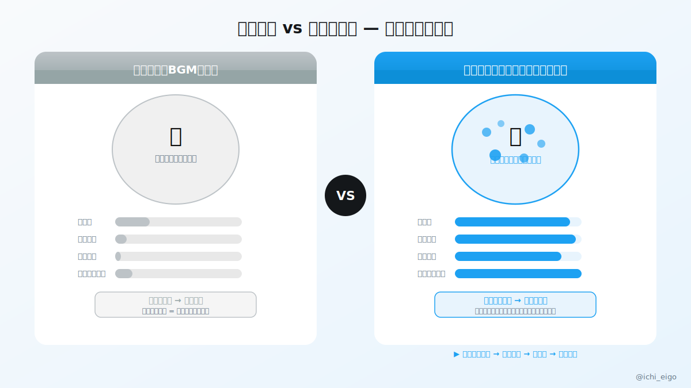
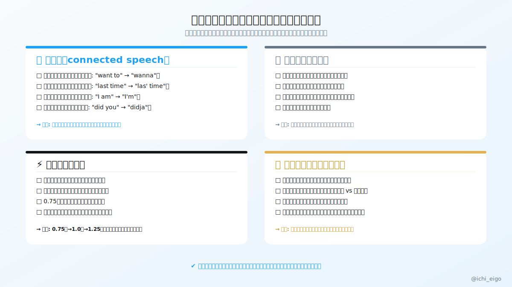

**意味がわからない音をいくら流しても、脳はそれをBGMとして処理するだけで何も学ばない。**

英語学習者の多くが「聞き流しを続ければ耳が慣れる」と信じているが、認知科学的にはこれは誤りだ。脳は「意味のある情報」にしか深く反応しない。理解できない音声が流れていても、聴覚野は反応するが意味処理層には届かない。結果として記憶に残らず、何時間流しても耳は育たない。同じ30分でも「ただ流す」と「能動的に聞く」では、脳の活性化エリアがまったく異なる。

では何をすればいいか。「聞き取れなかった箇所を止めて、なぜ聞き取れなかったかを特定する」だけでいい。原因は大きく4つ。①音変化（連結・脱落・同化）、②語彙の未知、③処理速度の不足、④アクセントの差異。チェックリストで原因を絞り込んだら、その1点だけを意識して同じ音源を再挑戦する。この小さなサイクルを1日3回まわすだけで、同じ30分が別物の練習になる。

原因を特定せずに何度も聞き直す「なんとなく再生」も、実は聞き流しと大差ない。「なぜ？」を言語化する瞬間に初めて脳の学習スイッチが入る。ListenUpでは音声と問題がセットになっているので、このサイクルを最短で体験できる。ぜひ今日の練習に取り入れてみてほしい。

同じ30分を使うなら、脳が本気で動く30分にしよう。

---
文字数: 421/800
