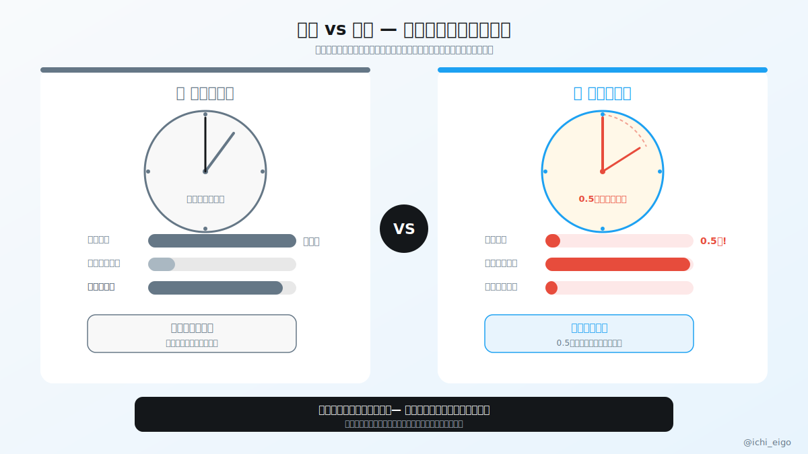
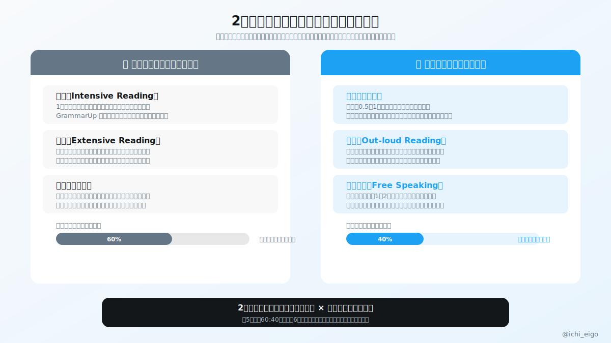

**「読めるけど話せない」は意志の問題でも才能の問題でもない。使っている脳回路がまったく別物なのだから、別々に鍛えるしかない。**

読解のときは自分のペースで文を処理できる。わからない単語があれば止まれるし、前の段落に戻ることもできる。一方、会話では相手の発話終了から0.5秒程度で反応しなければ不自然な間が生まれる。これだけでも「読む脳」と「話す脳」は根本的に違うことがわかる。読書で培った語彙力は確実に会話に活きるが、それだけでは話す速度は上がらない。

読解系（自分ペース回路）は精読・多読・リスニング読解を中心に、語彙と文法の理解を深める。これが会話の「素材」になる。発話系（瞬時処理回路）はシャドーイング・音読・即興発話を中心に、0.5秒以内に言葉を出す速度そのものを鍛える。推奨配分は読解60：発話40。「素材」なしに速度を鍛えても表現が底をつくが、素材だけ増やしても速度は上がらない。

初期は読解に比重を置いてもいい。語彙が少ない状態でシャドーイングをしても苦しいだけだ。単語力が一定水準に達したら、徐々に発話練習の比率を上げていく。GrammarUpで文法の読解力を底上げしながら、毎日5分でも音読を加えるだけでも、1ヶ月後には体感できる変化がある。

「読める」は最大の武器だ。それを「話す速度」に変換する練習を今日から加えよう。

---
文字数: 403/800
