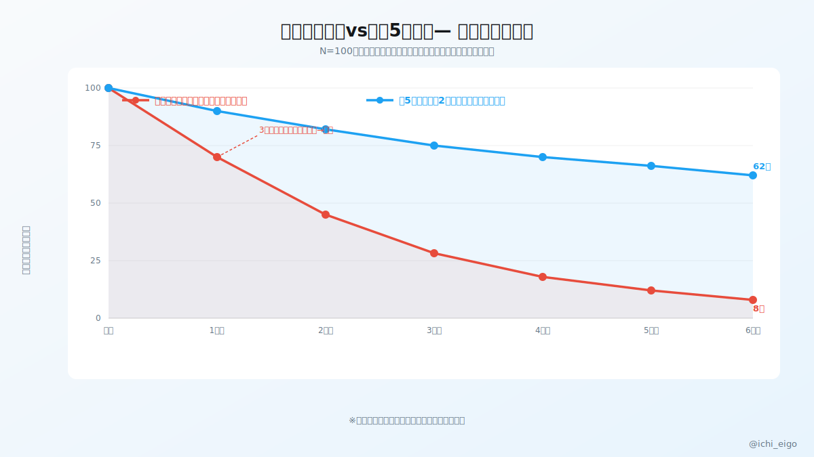
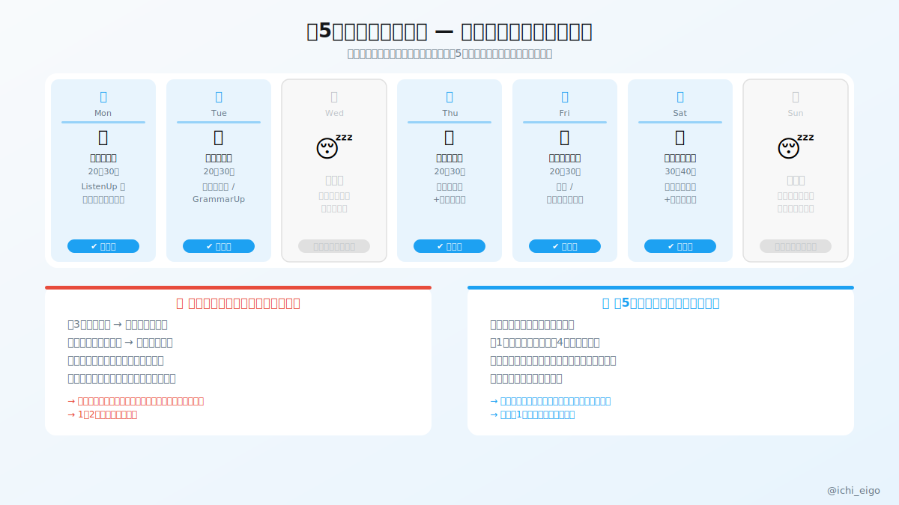

**「毎日やらなきゃ」と決めた瞬間、3日サボっただけで全部やめてしまうリスクが生まれる。**

習慣研究では、「完璧主義型」のルール設計は継続率を著しく下げることが知られている。「毎日やらなきゃ」という設計では、少しでも外れた瞬間に「もう失敗した」という認知が生まれ、そのまま習慣ごと捨ててしまう。言語の記憶は1〜2日の休息で消えることはなく、むしろ睡眠中に記憶の固定化（コンソリデーション）が進む。つまり休みは敵ではなく、学習の一部だ。

週5設計の核心は「休む日をあらかじめ決めること」だ。水曜と日曜をオフ日として最初から組み込んでおけば、その日に休んでも「計画通り」になる。仮に木曜も休んでしまったとしても、「今週は週4だった」で済む。翌週また5日こなせばいい。この「完璧でなくても続く設計」が、半年後・1年後の大きな差を生む。学習の中身はリスニング・語彙・スピーキングを分散させ、週末に軽いレビューを入れると定着効率がさらに上がる。

完璧主義を捨てるのは怠けることではない。長く続けるための合理的な設計だ。毎日やろうとして3ヶ月で燃え尽きるより、週5でゆっくり1年続けた人の方が圧倒的に成長している。まず今週の「休む日」を2日、今すぐカレンダーに入れてみよう。

習慣を続ける唯一のコツは、やめない設計を先に作ることだ。

---
文字数: 421/800
