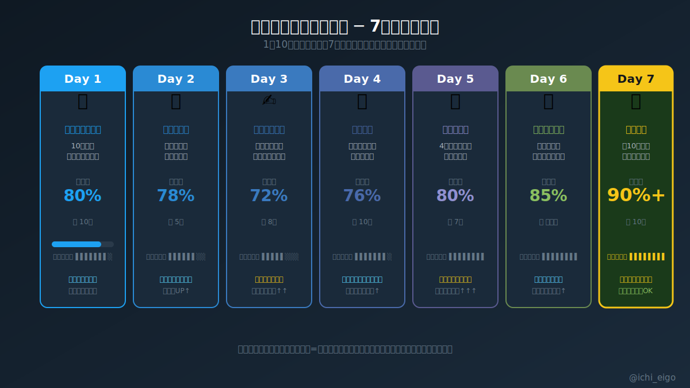

**記憶の定着は「何時間やるか」ではなく「何日続けるか」で決まる。**

「今日中に100単語マスターする」という計画は、実は脳の仕組みに反している。記憶の研究（Ebbinghaus の忘却曲線および後続の分散効果研究）によると、同じ学習量であっても1日に集中した場合は30日後の定着率が約8%まで落ちる一方、7日間に分散した場合は60%前後を維持する。脳は「何日も繰り返し入ってくる情報」を「生存に必要な重要情報」と判定し、長期記憶領域（海馬→大脳皮質）へ転送するメカニズムを持つためだ。1日10分でも、7日連続で同じ単語に触れることがカギになる。

7日間の理想サイクルは「初回インプット → 復習 → 能動テスト → 使う練習 → クイズ → 実場面応用 → 定着確認」の順だ。特に重要なのがDay 3の「能動的テスト（意味を隠して自力で思い出す）」と、Day 6の「実場面で使う」。前者は検索記憶強化（Testing Effect）、後者は感情・文脈との結びつきによる長期定着を促す。毎日の学習モードを変えることで、脳への刺激パターンが増し記憶ネットワークが強固になる。

実践的な目安は「1セット10単語 × 7日間」。これを週ごとにずらしながら積み上げると、月に約40〜50単語が長期記憶に入る。1日100個詰め込む作戦の数倍の効果を、10分の手間で得られる計算だ。焦って大量インプットするより、毎日少しずつ続ける方が圧倒的に速く語彙が増える。

記憶は量ではなく、日数と習慣が決め手になる。

---
文字数: 480/800
