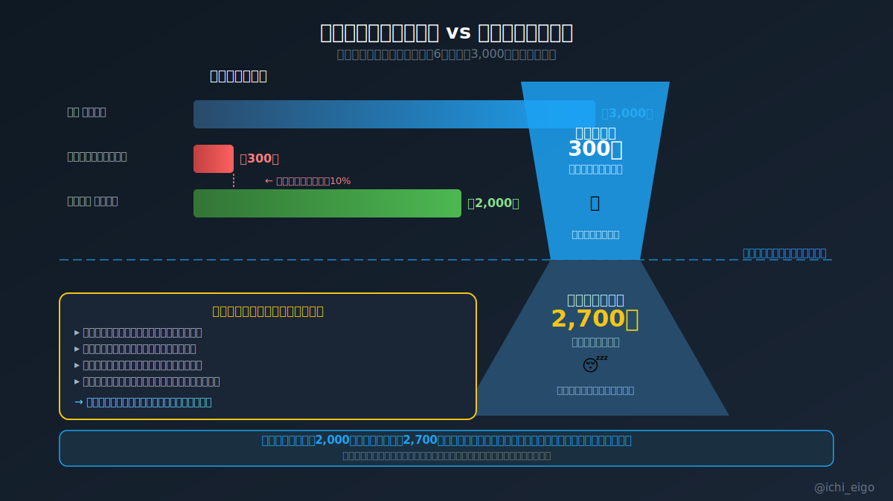
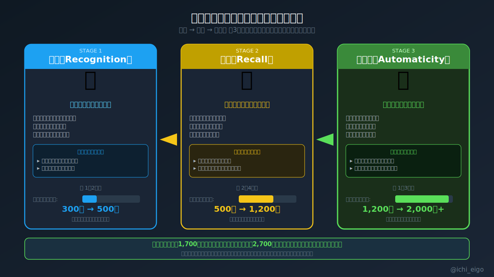

**あなたの英語力はゼロではない。日常会話に必要な2,000語を「すでに知っている」のに、使えないだけだ。**

中学・高校の6年間で日本人が学習する英単語数は約3,000語とされている（文部科学省の学習指導要領に基づく推計）。一方、多くの成人が実際にアウトプットできるアクティブ語彙は約300語程度と言われる。日常会話に必要とされる語彙数は約2,000語。つまり、あなたはすでにゴールに必要な語彙を持っている。問題は「知っているが使えない」パッシブ語彙が大量に眠っていることだ。これが生まれる理由は明確で、日本の英語教育が「試験のための認識」に特化し、アウトプット練習をほぼ行わなかったからだ。

眠った語彙を起こすには3段階がある。まず「再認」は、英文を見たら意味が取れる状態。教科書の再読や英英辞典で意識を向けるだけでいい。次の「再生」は、日本語から英語を自力で呼び出せる状態。英語実況や音読で使う回路を開く。最後の「自動化」は、考えずに語が口から出る状態で、これが本当の「話せる」だ。この3段階を経ることで、既存の2,700語のパッシブ語彙がアクティブ語彙として機能し始める。新語を1,700語暗記するより、この活性化に集中する方が英語力向上の速度は圧倒的に速い。

「ゼロから覚える」という思い込みを捨てた瞬間、英語学習の見え方が根本から変わる。

---
文字数: 494/800
