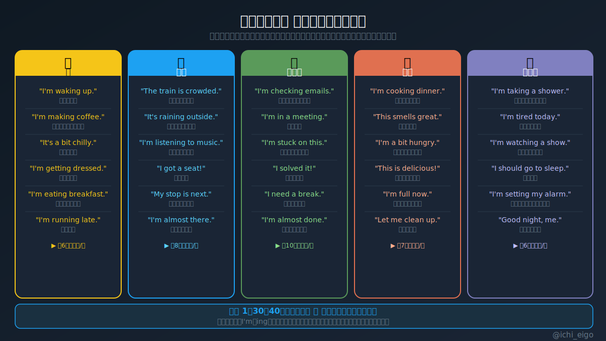
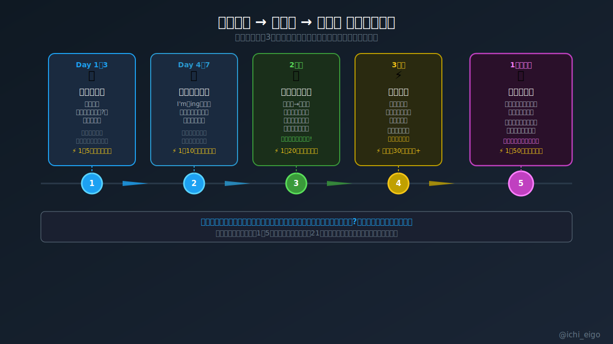

**「話す相手がいない」はもう言い訳にならない。自分の行動を英語で実況するだけで、1日30回以上のスピーキング練習になる。**

英語実況とは、目の前の行動・状況・感情をリアルタイムで英語に変換するトレーニングだ。朝コーヒーを淹れながら「I'm making coffee.」、電車に乗って「The train is crowded.」、仕事が詰まったら「I'm stuck on this.」。これだけでいい。現在進行形（I'm〜ing）を基本に、天気・感情・評価を一言加えるだけで表現の幅が広がる。1日の生活の中には、実況できるシーンが30〜50個は存在する。語学学校もアプリも不要、すべて「今この瞬間」がテキストになる。

始めて3日は「英語で言うと何だっけ？」と毎回詰まる。それが正常だ。1週目の終わりには変換スピードが上がり始め、2週目には「楽しくなってくる」フェーズに入る。21日目を超えると、英語フレーズが意識せず頭に浮かぶ「半自動化」が始まる。1ヶ月続ければ、英語は「覚える言語」から「出る言語」に変わる。これがスピーキング力の本当の土台だ。テキストを読むインプットより、アウトプットの絶対数が圧倒的に重要になる段階で、英語実況は最も即効性が高い手法になる。

完璧な文を作ろうとしなくていい。「今自分が感じたことを英語で言ってみる」この一歩を毎日続けることが、話せる自分への最短ルートだ。

---
文字数: 476/800
