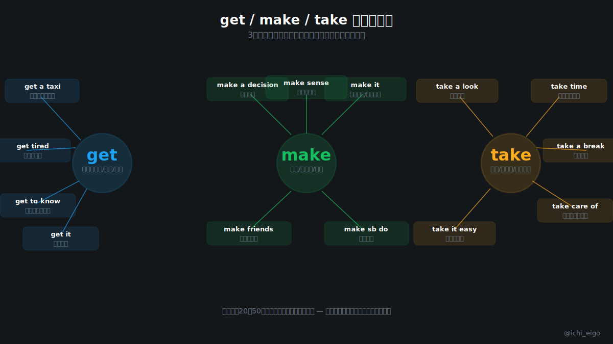
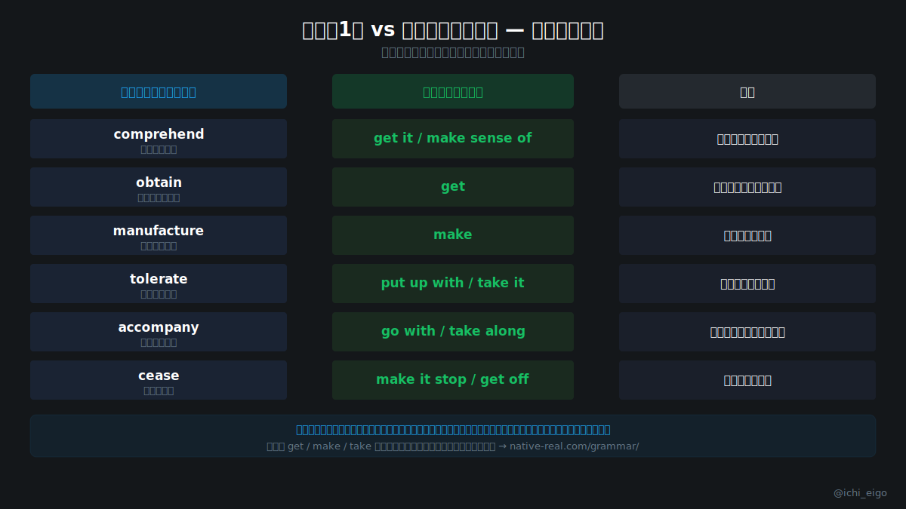

**基本動詞を「深く」使いこなす人が、英会話で一番伸びる。**

英語ネイティブの日常会話の約9割は、中学レベルの語彙2000語で成り立っていると言われています。なかでも get・make・take の3語は群を抜いて使用頻度が高く、それぞれ数十種類の意味とフレーズを持ちます。「get tired（疲れてくる）」「get to know（知るようになる）」「get it（理解する）」など、文脈によってまったく異なるニュアンスを表せるのが特徴です。

「comprehend（理解する）」より「get it」の方が会話では自然に響きます。難しい単語は書き言葉やフォーマルな場面では有効ですが、日常会話では基本動詞フレーズの方が圧倒的に通じやすく、使いやすいのです。make a decision・make sense・make it のように、makeひとつで「決断・理解・成功」まで表せます。take a break・take care of・take it easy も同様に、多彩な場面で活躍します。

難しい単語を100語覚えるより、get・make・takeを30パターンずつ身につける方が実戦的な英会話力は確実に上がります。英文法の基礎練習は [native-real.com/grammar/](/grammar/) で無料でできます。

**基本動詞を「広く浅く」ではなく「狭く深く」使いこなすことが、英会話上達の最短ルートです。**

---
文字数: 約380/800
