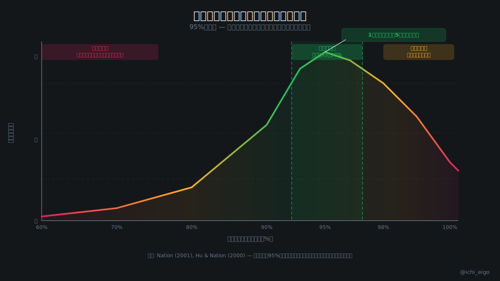
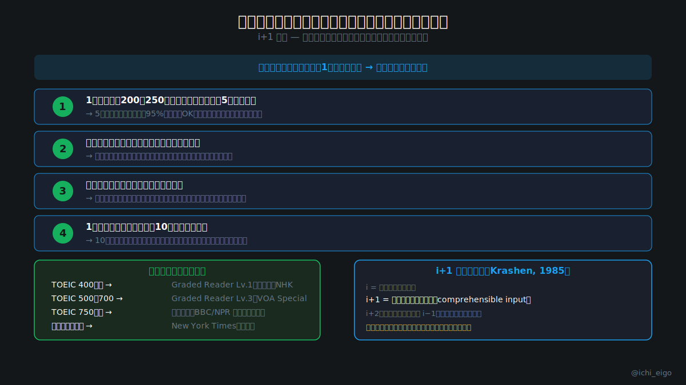

**多読の効果は「素材の選び方」で9割決まる。難しすぎる本を読んでも語彙は増えない。**

多読による語彙習得には「95%の法則」があります。Hu & Nation（2000）の研究では、テキスト内の既知語率が95%を下回ると、文脈から未知語を推測する能力が急激に低下することが示されました。つまり、1ページ（約200〜250語）に知らない単語が10語以上あるようなテキストでは、どれだけ読んでも語彙は増えにくいのです。

言語学者クラッシェンが提唱した「i+1理論」では、現在の理解レベル（i）より少しだけ難しい入力（i+1）が最も効率的に言語習得を促すとされています。実用的な目安は「1ページに知らない単語が5語以下」です。単語を飛ばしても大意が取れ、辞書なしでも楽しく読み進められる素材こそが多読に適しています。TOEIC 600点未満なら Graded Reader（段階別読み物）、700点前後なら VOA Special English が理想的な出発点です。

「難しい本を読んでいる自分」に満足せず、自分のレベルに合った素材を選ぶことが、語彙増加への最短ルートです。まずは [native-real.com](/) でリスニングクイズに挑戦して、自分の現在地を確認してみましょう。

**読む量より「読める素材の選び方」が、多読成功の鍵です。**

---
文字数: 約416/800
