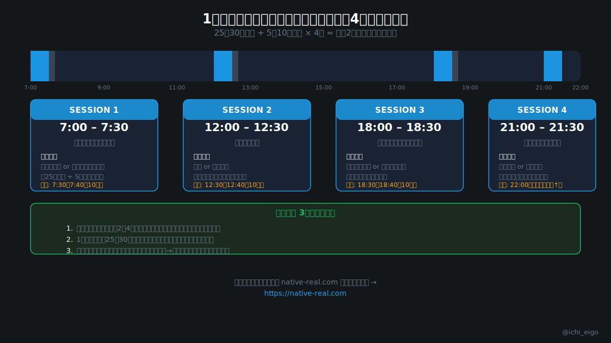

**学習の「量」より「間隔」が、記憶の定着率を決める。**

分散学習効果（Spacing Effect）は、心理学者エビングハウスが19世紀末に発見し、その後の研究で繰り返し実証されてきた認知科学の知見です。Cepeda ら（2006）の研究では、同じ学習時間でも「分散型」は「集中型」より長期的な記憶保持率が有意に高いことが示されています。2時間連続で勉強しても、3ヶ月後には約25%しか残らない。一方、30分×4回に分けて学習し適切な間隔で復習すると、同じ期間後に約55%以上が記憶に残ります。

実践方法は「1セッション25〜30分 + 休憩5〜10分」を1日4回設定するだけです。朝（7:00）・昼（12:00）・夕方（18:00）・就寝前（21:00）に分けるのが理想です。特に就寝前のセッションは効果的で、睡眠中に海馬から大脳皮質へ記憶が転送される「記憶の固定化」が起きるためです。セッション間隔は最低2〜4時間あけることで、記憶の再強化が効果的に機能します。

「今日2時間まとめてやろう」ではなく「今日は30分×4回やろう」という発想に切り替えるだけで、同じ努力量で大きな差が生まれます。毎日のリスニング練習は [native-real.com](/) で無料スタートできます。

**毎日の習慣を「細切れ」に変えるだけで、英語学習の定着率は劇的に変わります。**

---
文字数: 約440/800
